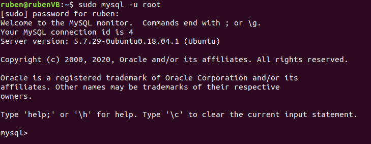
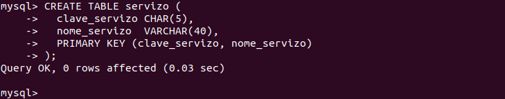
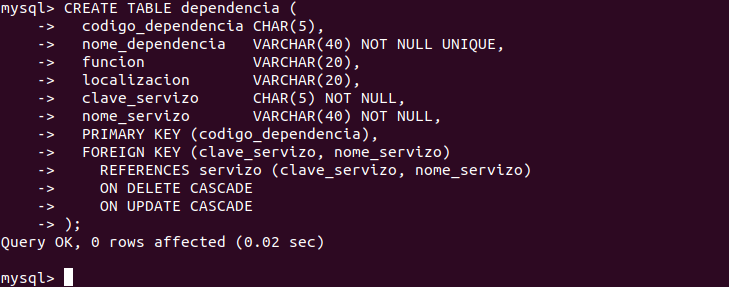
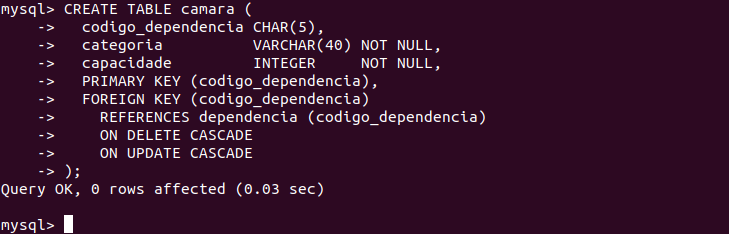
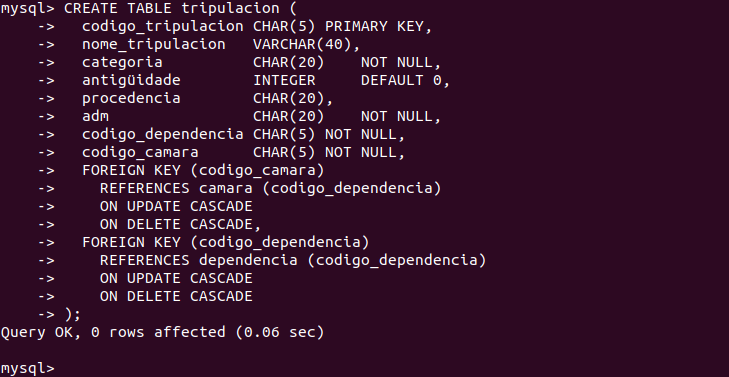
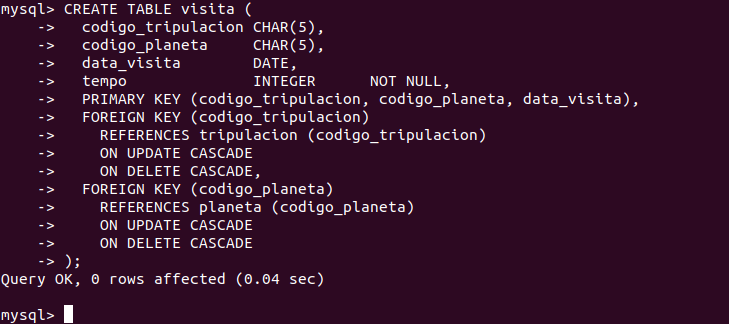
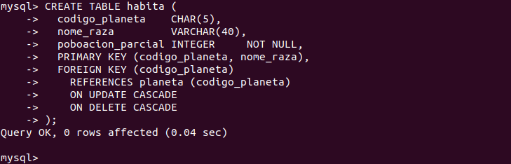
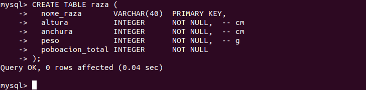

# Creación de la base de datos "naves-espaciais"
En este apartado se explicará la creación de la BD "naves-espaciais" del esquema relacional explicado en [este ejercicio.](https://github.com/davidgchaves/first-steps-with-git-and-github-wirtz-asir1-and-dam1/tree/master/exercicios-ddl/2-naves-espaciais)

> Esta sección está documentada para los comandos SQL necesarios en una máquina con Ubuntu 18 con MySQL Server instalado en ella
## Índice
  - [Inicio de sesión y creación del schema](#inicio-de-sesi%c3%b3n-y-creaci%c3%b3n-del-schema)
  - [Tabla Servizo](#tabla-servizo)
  - [Tabla Dependencia](#tabla-dependencia)
  - [Tabla Camara](#tabla-camara)
  - [Tabla Tripulación](#tabla-tripulaci%c3%b3n)
  - [Tabla Planeta](#tabla-planeta)
  - [Tabla Visita](#tabla-visita)
  - [Tabla Habita](#tabla-habita)
  - [Tabla Raza](#tabla-raza)
  - [Claves foráneas Habita](#claves-for%c3%a1neas-habita)
  - [Comprobaciones Camara](#comprobaciones-camara)

### Inicio de sesión y creación del schema
Abrimos un nuevo terminal en Ubuntu e iniciamos sesión en el servidor MySQL:



Usamos los siguientes comandos para crear el Schema y marcarlo como el schema activo:
```sql
CREATE SCHEMA naves_espaciais;
USE naves_espaciais;
```


[Volver al índice](#%c3%8dndice)
### Tabla Servizo
Este es el comando para crear la tabla:
```sql
CREATE TABLE servizo (
  clave_servizo CHAR(5),
  nome_servizo  VARCHAR(40),
  PRIMARY KEY (clave_servizo, nome_servizo)
);
```


[Volver al índice](#%c3%8dndice)
### Tabla Dependencia
Este es el comando para crear la tabla:
```sql
CREATE TABLE dependencia (
  codigo_dependencia CHAR(5),
  nome_dependencia   VARCHAR(40) NOT NULL UNIQUE,
  funcion            VARCHAR(20),
  localizacion       VARCHAR(20),
  clave_servizo      CHAR(5) NOT NULL,
  nome_servizo       VARCHAR(40) NOT NULL,
  PRIMARY KEY (codigo_dependencia),
  FOREIGN KEY (clave_servizo, nome_servizo)
    REFERENCES servizo (clave_servizo, nome_servizo)
    ON DELETE CASCADE
    ON UPDATE CASCADE
);
```


[Volver al índice](#%c3%8dndice)
### Tabla Camara
Este es el comando para crear la tabla:
```sql
CREATE TABLE camara (
  codigo_dependencia CHAR(5),
  categoria          VARCHAR(40) NOT NULL,
  capacidade         INTEGER     NOT NULL,
  PRIMARY KEY (codigo_dependencia),
  FOREIGN KEY (codigo_dependencia)
    REFERENCES dependencia (codigo_dependencia)
    ON DELETE CASCADE
    ON UPDATE CASCADE
);
```


[Volver al índice](#%c3%8dndice)
### Tabla Tripulación
Este es el comando para crear la tabla:
```sql
CREATE TABLE tripulacion (
  codigo_tripulacion CHAR(5) PRIMARY KEY,
  nome_tripulacion   VARCHAR(40),
  categoria          CHAR(20)    NOT NULL,
  antigüidade        INTEGER     DEFAULT 0,
  procedencia        CHAR(20),
  adm                CHAR(20)    NOT NULL,
  codigo_dependencia CHAR(5) NOT NULL,
  codigo_camara      CHAR(5) NOT NULL,
  FOREIGN KEY (codigo_camara)
    REFERENCES camara (codigo_dependencia)
    ON UPDATE CASCADE
    ON DELETE CASCADE,
  FOREIGN KEY (codigo_dependencia)
    REFERENCES dependencia (codigo_dependencia)
    ON UPDATE CASCADE
    ON DELETE CASCADE
);
```


[Volver al índice](#%c3%8dndice)
### Tabla Planeta
Este es el comando para crear la tabla:
```sql
CREATE TABLE planeta (
  codigo_planeta CHAR(5)          PRIMARY KEY,
  nome_planeta   VARCHAR(40) NOT NULL UNIQUE,
  galaxia        VARCHAR(40) NOT NULL,
  coordenadas    CHAR(15)    NOT NULL UNIQUE
 );
```


[Volver al índice](#%c3%8dndice)
### Tabla Visita
Este es el comando para crear la tabla:
```sql
CREATE TABLE visita (
  codigo_tripulacion CHAR(5),
  codigo_planeta     CHAR(5),
  data_visita        DATE,
  tempo              INTEGER      NOT NULL,
  PRIMARY KEY (codigo_tripulacion, codigo_planeta, data_visita),
  FOREIGN KEY (codigo_tripulacion)
    REFERENCES tripulacion (codigo_tripulacion)
    ON UPDATE CASCADE
    ON DELETE CASCADE,
  FOREIGN KEY (codigo_planeta)
    REFERENCES planeta (codigo_planeta)
    ON UPDATE CASCADE
    ON DELETE CASCADE 
);
```


[Volver al índice](#%c3%8dndice)
### Tabla Habita
Este es el comando para crear la tabla:
```sql
CREATE TABLE habita (
  codigo_planeta    CHAR(5),
  nome_raza         VARCHAR(40),
  poboacion_parcial INTEGER     NOT NULL,
  PRIMARY KEY (codigo_planeta, nome_raza),
  FOREIGN KEY (codigo_planeta)
    REFERENCES planeta (codigo_planeta)
    ON UPDATE CASCADE
    ON DELETE CASCADE
);
```


[Volver al índice](#%c3%8dndice)
### Tabla Raza
Este es el comando para crear la tabla:
```sql
CREATE TABLE raza (
  nome_raza       VARCHAR(40)  PRIMARY KEY,
  altura          INTEGER      NOT NULL,  -- cm
  anchura         INTEGER      NOT NULL,  -- cm
  peso            INTEGER      NOT NULL,  -- g
  poboacion_total INTEGER      NOT NULL
);
```


[Volver al índice](#%c3%8dndice)
### Claves foráneas Habita
Este es el comando para alterar la tabla y añadir las claves foráneas:
```sql
ALTER TABLE habita
  ADD FOREIGN KEY (nome_raza)
    REFERENCES raza (nome_raza)
    ON UPDATE CASCADE
    ON DELETE CASCADE;
```


[Volver al índice](#%c3%8dndice)
### Comprobaciones Camara
Este es el comando para añadir un `CHECK` a la tabla:
```sql
ALTER TABLE camara
  ADD CONSTRAINT capacidade_maior_de_cero
    CHECK (capacidade > 0);
```


[Volver al índice](#%c3%8dndice)