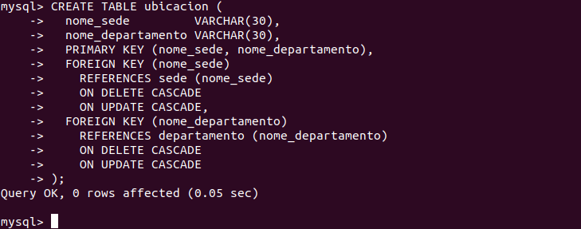
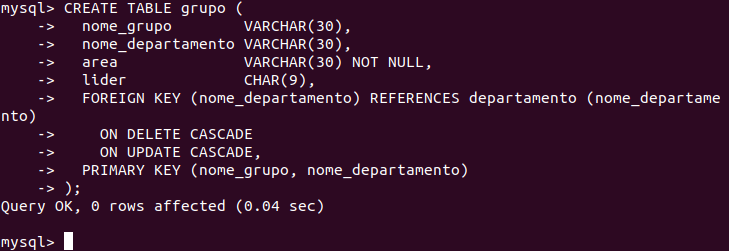
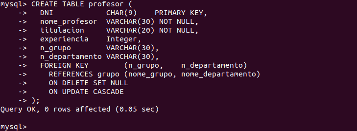
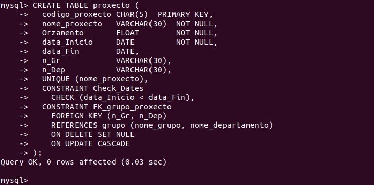
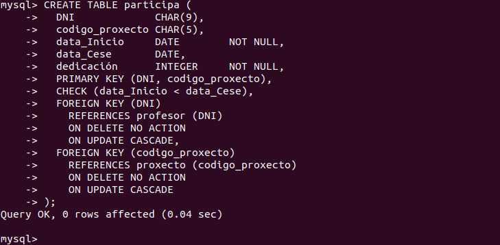
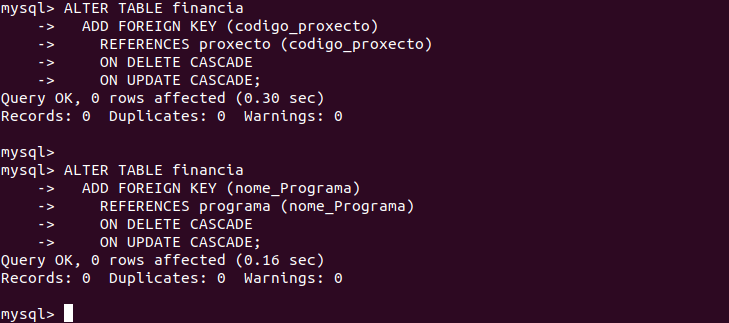
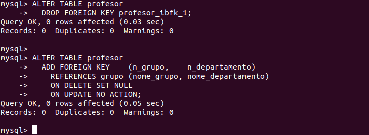

# Creación de la base de datos "proxecto-investigacion"
En este apartado se explicará la creación de la BD "proxecto-investigacion" del esquema relacional explicado en [este ejercicio.](https://github.com/davidgchaves/first-steps-with-git-and-github-wirtz-asir1-and-dam1/tree/master/exercicios-ddl/1-proxectos-de-investigacion)

> Esta sección está documentada para los comandos SQL necesarios en una máquina con Ubuntu 18 con MySQL Server instalado en ella

## Índice
 - [Inicio de sesión y creación del schema](#inicio-de-sesi%c3%b3n-y-creaci%c3%b3n-del-schema)
 - [Tabla Sede](#tabla-sede)
 - [Tabla Departamento](#tabla-departamento)
 - [Tabla Ubicación](#tabla-ubicaci%c3%b3n)
 - [Tabla Grupo](#tabla-grupo)
 - [Tabla Profesor](#tabla-profesor)
 - [Tabla Proxecto](#tabla-proxecto)
 - [Claves foráneas Departamento](#claves-for%c3%a1neas-departamento)
 - [Claves foráneas Grupo](#claves-for%c3%a1neas-grupo)
 - [Tabla Participa](#tabla-participa)
 - [Tabla Programa](#tabla-programa)
 - [Tabla Financia](#tabla-financia)
 - [Claves foráneas Financia](#claves-for%c3%a1neas-financia)
 - [Correcciones](#correcciones)

### Inicio de sesión y creación del schema
Abrimos un nuevo terminal en Ubuntu e iniciamos sesión en el servidor MySQL:


Usamos los siguientes comandos para crear el Schema y marcarlo como el schema activo:
```sql
CREATE SCHEMA proxecto_investigacion;
USE proxecto_investigacion;
```


[Volver al índice](#%c3%8dndice)
### Tabla Sede
Este es el comando para crear la tabla:
```sql
CREATE TABLE sede (
  nome_sede VARCHAR(30),
  campus    VARCHAR(30)  NOT NULL,
  PRIMARY KEY (nome_sede)
);
```


> En MySQL no podemos crear dominios personalizados

[Volver al índice](#%c3%8dndice)
### Tabla Departamento
Este es el comando para crear la tabla:
```sql
CREATE TABLE departamento (
  nome_departamento VARCHAR(30)  PRIMARY KEY,
  telefono          CHAR(9)      NOT NULL,
  director          CHAR(9)
);
```

> El atributo director no es marcado como clave foránea debido a que la tabla a la que referencia no existe todavía. Una vez la tabla esté creada se hará un `ALTER TABLE` para especificar que director es clave foránea

[Volver al índice](#%c3%8dndice)
### Tabla Ubicación
Este es el comando para crear la tabla:
```sql
CREATE TABLE ubicacion (
  nome_sede         VARCHAR(30),
  nome_departamento VARCHAR(30),
  PRIMARY KEY (nome_sede, nome_departamento),
  FOREIGN KEY (nome_sede)
    REFERENCES sede (nome_sede)
    ON DELETE CASCADE
    ON UPDATE CASCADE,
  FOREIGN KEY (nome_departamento)
    REFERENCES departamento (nome_departamento)
    ON DELETE CASCADE
    ON UPDATE CASCADE
);
```


> **NOTA:** Cuando especificas a que tabla referencia la clave foránea tienes que indicar obligatoriamente a que atributos de la misma apunta, no como en PostgreSQL que si se omitian se referenciaba a la clave primaria

[Volver al índice](#%c3%8dndice)
### Tabla Grupo
Este es el comando para crear la tabla:
```sql
CREATE TABLE grupo (
  nome_grupo        VARCHAR(30),
  nome_departamento VARCHAR(30),
  area              VARCHAR(30) NOT NULL,
  lider             CHAR(9),
  FOREIGN KEY (nome_departamento) REFERENCES departamento (nome_departamento)
    ON DELETE CASCADE 
    ON UPDATE CASCADE,
  PRIMARY KEY (nome_grupo, nome_departamento)
);
```


[Volver al índice](#%c3%8dndice)
### Tabla Profesor
Este es el comando para crear la tabla:
```sql
CREATE TABLE profesor (
  DNI            CHAR(9)    PRIMARY KEY,
  nome_profesor  VARCHAR(30) NOT NULL, 
  titulacion     VARCHAR(20) NOT NULL,
  experiencia    Integer,
  n_grupo        VARCHAR(30),
  n_departamento VARCHAR(30),
  FOREIGN KEY        (n_grupo,    n_departamento)
    REFERENCES grupo (nome_grupo, nome_departamento)
    ON DELETE SET NULL
    ON UPDATE CASCADE
);
```


[Volver al índice](#%c3%8dndice)
### Tabla Proxecto
Este es el comando para crear la tabla:
```sql
CREATE TABLE proxecto (
  codigo_proxecto CHAR(5)  PRIMARY KEY,
  nome_proxecto   VARCHAR(30)  NOT NULL,
  Orzamento       FLOAT        NOT NULL,
  data_Inicio     DATE         NOT NULL,
  data_Fin        DATE,
  n_Gr            VARCHAR(30),
  n_Dep           VARCHAR(30),
  UNIQUE (nome_proxecto),
  CONSTRAINT Check_Dates
    CHECK (data_Inicio < data_Fin),
  CONSTRAINT FK_grupo_proxecto
    FOREIGN KEY (n_Gr, n_Dep)
    REFERENCES grupo (nome_grupo, nome_departamento)
    ON DELETE SET NULL
    ON UPDATE CASCADE
);
```


[Volver al índice](#%c3%8dndice)
### Claves foráneas Departamento
Este es el comando para alterar la tabla y añadir las claves foráneas:
```sql
ALTER TABLE departamento
  ADD FOREIGN KEY (director)
    REFERENCES profesor (DNI)
    ON DELETE SET NULL
    ON UPDATE CASCADE;
```


[Volver al índice](#%c3%8dndice)
### Claves foráneas Grupo
Este es el comando para alterar la tabla y añadir las claves foráneas:
```sql
ALTER TABLE grupo
  ADD FOREIGN KEY (lider)
    REFERENCES profesor (DNI)
    ON DELETE SET NULL
    ON UPDATE CASCADE;
```


[Volver al índice](#%c3%8dndice)
### Tabla Participa
Este es el comando para crear la tabla:
```sql
CREATE TABLE participa (
  DNI             CHAR(9),
  codigo_proxecto CHAR(5),
  data_Inicio     DATE        NOT NULL,
  data_Cese       DATE,
  dedicación      INTEGER     NOT NULL,
  PRIMARY KEY (DNI, codigo_proxecto),
  CHECK (data_Inicio < data_Cese),
  FOREIGN KEY (DNI)
    REFERENCES profesor (DNI)
    ON DELETE NO ACTION
    ON UPDATE CASCADE,
  FOREIGN KEY (codigo_proxecto)
    REFERENCES proxecto (codigo_proxecto)
    ON DELETE NO ACTION
    ON UPDATE CASCADE
);
```


[Volver al índice](#%c3%8dndice)
### Tabla Programa
Este es el comando para crear la tabla:
```sql
CREATE TABLE programa (
  nome_Programa VARCHAR(30) PRIMARY KEY
); 
```


[Volver al índice](#%c3%8dndice)
### Tabla Financia
Este es el comando para crear la tabla:
```sql
CREATE TABLE financia (
  nome_Programa        VARCHAR(30),
  codigo_proxecto      CHAR(5),
  numero_Programa      CHAR(5) NOT NULL,
  cantidade_Financiada FLOAT       NOT NULL,
  PRIMARY KEY (nome_Programa, codigo_proxecto)
);
```


[Volver al índice](#%c3%8dndice)
### Claves foráneas Financia
Este es el comando para alterar la tabla y añadir las claves foráneas:
```sql
ALTER TABLE financia
  ADD FOREIGN KEY (codigo_proxecto)
    REFERENCES proxecto (codigo_proxecto)
    ON DELETE CASCADE
    ON UPDATE CASCADE;

ALTER TABLE financia
  ADD FOREIGN KEY (nome_Programa)
    REFERENCES programa (nome_Programa)
    ON DELETE CASCADE
    ON UPDATE CASCADE;
```


[Volver al índice](#%c3%8dndice)
### Correcciones
Al crear la tabla profesor se ha puesto mal el `ON UPDATE` y el `ON DELETE` de las claves foráneas. Para corregirlo tenemos que borrar la restricción de clave foránea y volver a añadirla con el `ALTER TABLE`:
```sql
ALTER TABLE profesor
  DROP FOREIGN KEY profesor_ibfk_1;

ALTER TABLE profesor
  ADD FOREIGN KEY    (n_grupo,    n_departamento)
    REFERENCES grupo (nome_grupo, nome_departamento)
    ON DELETE SET NULL
    ON UPDATE NO ACTION;
```


[Volver al índice](#%c3%8dndice)